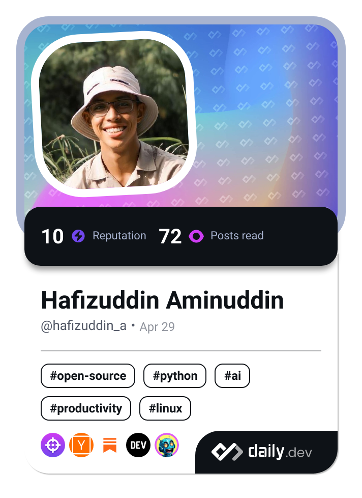

<a class="badge-base__link LI-simple-link" href="https://sg.linkedin.com/in/hafizuddin-aminuddin?trk=profile-badge">Hafizuddin Aminuddin</a>

# 💫 About Me:
~~- 🔭 Currently developing a specialized mouse for people with limited mobility.~~
- 👯 Open to collaborations in accessibility tech, healthcare, and space systems.
- 🤝 Looking for a Full-time role to contribute to impactful projects.
- 🌱 Learning Software Engineering and Machine learning.
- ✍️ I write on [Medium](https://medium.com/@hafizuddin-a) about Islamic topics and more.
- 🌍 Outdoor enthusiast: hiking, diving, and exploring nature.
- ⚡ Fun fact: I love trying new things and exploring uncharted territories.

## 🌐 Socials:
 

## 📝 Medium Posts
📖 **Check out my latest post below!**
<!-- BLOG-POST-LIST:START -->
- [The Breath of Mercy](https://medium.com/@hafizuddin-a/the-breath-of-mercy-b8f44aa26990?source=rss-761d07697f8c------2)
- [A Reminder of Our Need for Allah](https://medium.com/@hafizuddin-a/a-reminder-of-our-need-for-allah-af745ff14074?source=rss-761d07697f8c------2)
- [Remembering Death to Live](https://medium.com/@hafizuddin-a/remembering-death-to-live-44413f1f1eb3?source=rss-761d07697f8c------2)
- [Rediscovering Our Innate Faith](https://medium.com/@hafizuddin-a/rediscovering-our-innate-faith-5e4cfe32d1a8?source=rss-761d07697f8c------2)
- [Finding Ease in Unexpected Places](https://medium.com/@hafizuddin-a/finding-ease-in-unexpected-places-a-personal-reflection-db1cad061957?source=rss-761d07697f8c------2)
<!-- BLOG-POST-LIST:END -->

# 💻 Tech Stack:

### Languages:
 

 
 
 
 
 
 
 

### Frameworks & Libraries:
 
 

### Databases:
 
 

### Tools & Platforms:
 
 

