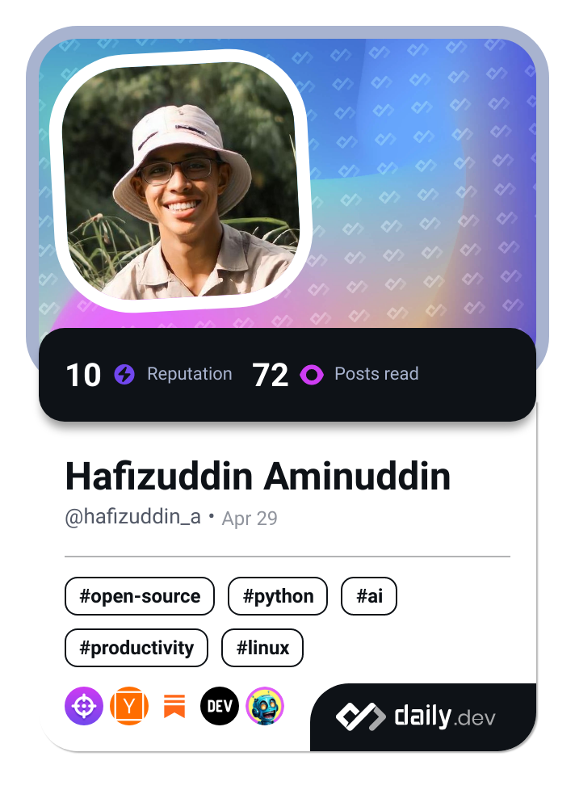

# 💫 About Me:
- 🔭 I’m currently working on **[Your Current Projects]**.
- 👯 I’m looking to collaborate on **[Areas or Projects You Want to Collaborate On]**.
- 🤝 I’m looking for help with **[Specific Areas Where You Need Assistance]**.
- 🌱 I’m currently learning **[New Skills or Technologies You're Learning]**.
- 💬 Ask me about **[Your Expertise or Topics You’re Passionate About]**.
- ⚡ Fun fact: **[Interesting Fact About You]**.

## 🌐 Socials:
 

# 💻 Tech Stack:

### Languages:
 
 
 
 
 
 
 
 

### Frameworks & Libraries:
 
 

### Databases:

 
 
 

### Tools & Platforms:
 
 

### Hardware & IoT:

 

# 📊 GitHub Stats:
 
 

# 📝 Medium posts
<!-- BLOG-POST-LIST:START -->
- [Rediscovering Our Innate Faith](https://medium.com/@hafizuddin-a/rediscovering-our-innate-faith-5e4cfe32d1a8?source=rss-761d07697f8c------2)
- [Finding Ease in Unexpected Places](https://medium.com/@hafizuddin-a/finding-ease-in-unexpected-places-a-personal-reflection-db1cad061957?source=rss-761d07697f8c------2)
<!-- BLOG-POST-LIST:END -->

